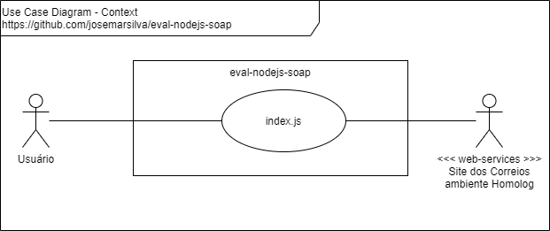
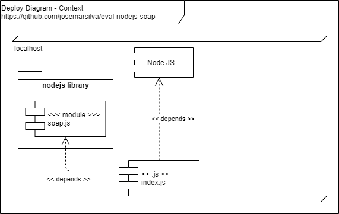

## 1. Introduction

Project **eval-nodejs-soap** is an evaluation of library 'soap' on NodeJS.

## 2. Diagrams

### 2.1. Use Case Diagram

 


### 2.2. Deploy Diagram

 


## 3. Technologies Used
* NodeJS
* Yarn
* Library: ('soap')

## 4. Project

### 4.1. Guide for Users

* n/a

### 4.2. Guide for Developers

* n/a

### 4.3. Guide for Configuration

* Inicializando repositorio

```cmd
C:\..\eval-nodejs-soap> npm init
```

* Baixando e Instalando biblioteca `soap`

  * Download Yarn from https://classic.yarnpkg.com/en/docs/install
  * Instalando:

```cmd
C:\..\eval-nodejs-soap> yarn add soap
```

### 3.4. Guide for Test

* n/a

### 3.5. Guide for Demonstration

* n/a

### 3.7. Patterns, Standard, Conventions and Best Practices

* n/a


## I - References

* Guide
  * https://www.npmjs.com/package/soap
  * https://stackoverflow.com/questions/8655252/node-js-how-to-consume-soap-xml-web-service
* Hands on
  * https://www.youtube.com/watch?v=FqDenKN5y1s
  * https://classic.yarnpkg.com/en/docs/install/#windows-stable
  * https://apphom.correios.com.br/SigepMasterJPA/AtendeClienteService/AtendeCliente?wsdl
* Samples
  * https://github.com/vpulim/node-soap
  * https://medium.com/better-programming/how-to-perform-soap-requests-with-node-js-4a9627070eb6